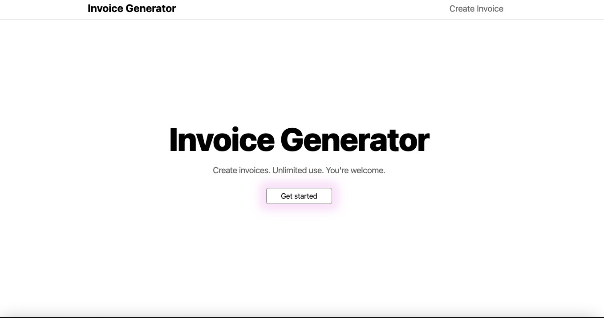

## Invoice Generator

In this application the user can enter data relating to his invoice, such as description, quantity, VAT%.
The application will take care of calculating the final total and the final VAT%.
Subsequently, the user saves his invoice in pdf format, or if he wishes, he can print the generated invoice.

Here is a [Live Demo](https://invoice-generator-ecru.vercel.app/).

